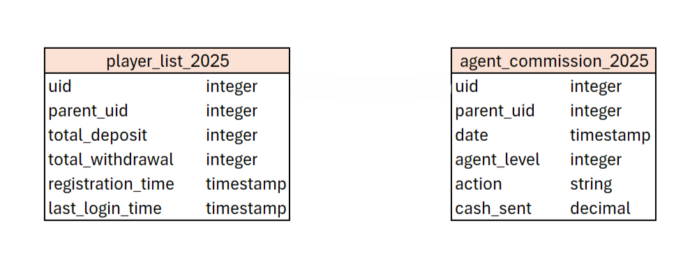
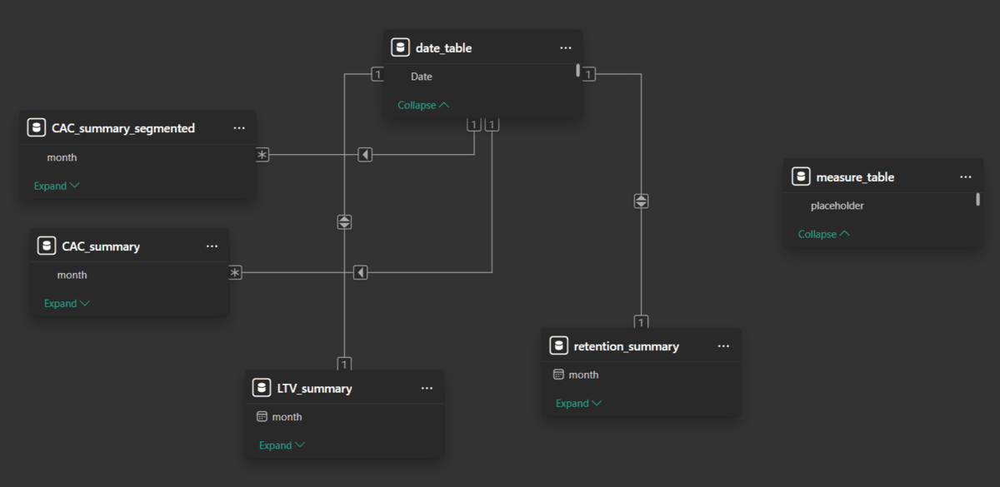
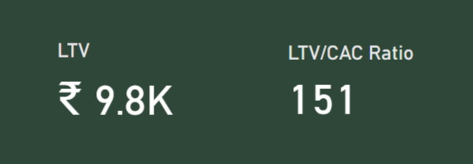
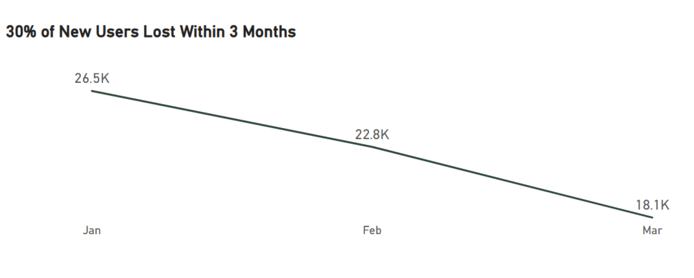
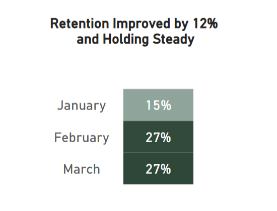
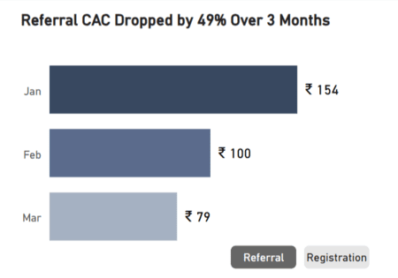
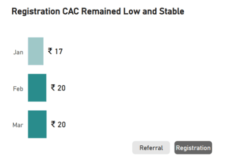
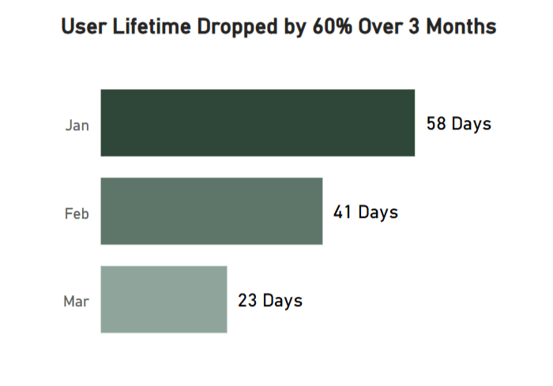
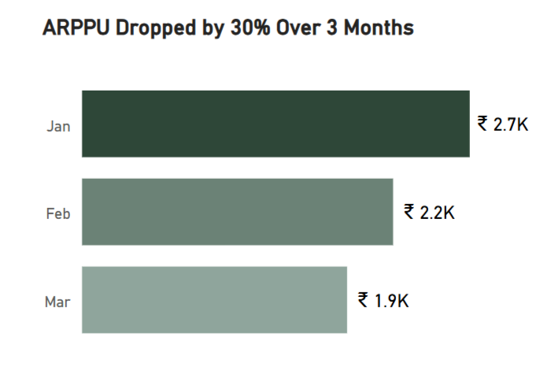

# **Revenue Growth via Agent Channel Analysis – Project Overview**

A **B2C fintech platform, established in 2023, targeting the Indian market**, where users participate in event-driven activities through a gamified wallet and voucher system. **The platform relies on a nationwide agent network to drive high-volume transactions and early monetization**.

This project is part of an ongoing quarterly performance review of the Agent Acquisition Campaign, focused on optimizing user acquisition costs and maximizing short-term revenue growth. The version presented here highlights the 2025 reporting cycle, aiming to boost revenue growth through financial efficiency and acquisition strategies.

The latest analysis is current as of May 2025, covering data up to March 2025, and is **actively used in high-level decision-making discussions** with the Ops Manager, Finance Lead, and Promotion Coordinator **to guide acquisition strategies and accelerate revenue growth**.

> **Disclaimer**: All user data and agent identities has been anonymized. No personally identifiable information (PII) is used in this analysis, in accordance with internal data protection policies and privacy standards.

🔗 **Resources**  
👉 [**Power BI Dashboard** – Viewable Online *(no download required)*](https://app.powerbi.com/view?r=eyJrIjoiN2EyMTI1ZjUtMmU0My00ZmYyLWExZGYtZTAyYzJkNzBiZWZiIiwidCI6IjFjNWQyOWRjLTgzMDItNGE3YS04ODU4LTY1NzM5ZGY2ZWQyMyIsImMiOjEwfQ%3D%3D)  
📄 [*SQL Query - CAC Summary*](./sql/cac_summary.sql)    
📄 [*SQL Query - CAC Segmented Summary*](./sql/cac_summary_segmented.sql)  
📄 [*SQL Query - LTV Summary*](./sql/ltv_summary.sql)  
📄 [*SQL Query - Retention Summary*](./sql/retention_summary.sql)

---

# **Data Structure**  
The data used in this project consists of two main tables:
- `agent_commission_2025`
- `player_list_2025`

The agent_commission table contains information on commissions paid to agents, categorized by action type. The player_list table stores user information across the platform (*only relevant fields are used for this project*). Both tables collectively contain 17 million rows for this project.

The screenshot below shows the data structure and is intentionally not joined, as the tables serve different analytical purposes. All business metrics are pre-aggregated using SQL, and no direct relationship between raw tables is required for this analysis.

The screenshot below shows the Power BI semantic model, all complex business logic and aggregations are processed using pre-aggregated SQL queries to handle large datasets efficiently, while Power BI focuses on KPI calculations, relationship management, and visualization.

---

# **Executive Summary**

**In February 2025, the platform faced a significant operational crisis**, withdrawal delays skyrocketed, damaging user confidence and triggering a sharp decline in transaction volumes.  
Crucially, this crisis didn’t only affect paying users, **agents—who also play a key role as community influencers—lost trust in the platform**, leading to a sharp decline in agent engagement and acquisition performance.

The Agent Campaign successfully delivered a strong LTV/CAC Ratio of 151x in Q1 2025, despite critical business risks and declining agent loyalty during this period. However, **this performance marked a significant decline from the 186x ratio achieved in Q4 2024**, highlighting the volatility of short-lifecycle acquisition strategies and the urgency for strategic recovery initiatives to sustain profitability and growth.

To evaluate growth performance, we track two primary KPIs:
- **LTV**
- **LTV/CAC Ratio**

These metrics measure the campaign's efficiency in generating revenue.

To evaluate agents performance, we focus on four supporting metrics:
- **Retention**
- **Customer Acquisition Cost (CAC)**
- **User Lifetime**
- **Average Revenue Per Paying User (ARPPU)**

These supporting metrics are critical in maintaining healthy LTV and LTV/CAC Ratio performance. While **User Lifetime and Retention are not expected to remain high under this campaign model**, they are carefully monitored to ensure growth and profitability are sustained.

👉 *Below is the main Dashboard page*  
This is an [**Power BI Dashboard** – Viewable Online *(no download required)*](https://app.powerbi.com/view?r=eyJrIjoiN2EyMTI1ZjUtMmU0My00ZmYyLWExZGYtZTAyYzJkNzBiZWZiIiwidCI6IjFjNWQyOWRjLTgzMDItNGE3YS04ODU4LTY1NzM5ZGY2ZWQyMyIsImMiOjEwfQ%3D%3D)

---

# **Insight Deep Dive**

## **New User Churn Trend**

- **30% of new users churned within 3 months**, cutting off potential revenue streams at the early stage.  
- The **February crisis triggered a sharp collapse in new user acquisition, with the sharpest monthly decline over 20%** immediately following in March. 
- This sharp decline crippled the agent campaign's ability to sustain growth and revenue momentum in Q1 2025.   

## **User Retention**

- Retention jumped from 15% in January to 27% in February, marking a strong recovery in user engagement.
- Despite the decline in new user acquisition from February to March, the agent campaign successfully maintained a stable retention rate at 27%.
- However, **the improved retention rate was still not sufficient to offset the revenue impact caused by declining new user volumes**.  

## **Customer Acquisition Cost (CAC)**

  
  

> - **Referral CAC** reflects the cost when agents successfully recruit new agents, creating a multi-level referral structure that generates ongoing commissions.
> - **Registration CAC** represents the cost when agents acquire new users who register.

- Referral CAC dropped significantly by 49% over three months ₹154 to ₹79.
- **The sharp decline in Referral CAC during February reflects weakened user trust**, resulting in fewer referrals and reduced acquisition through agents  
- **Registration CAC remained low and stable at ₹20, emphasizing that acquisition cost efficiency was maintained even as performance weakened**.

## **User Lifetime**

- User lifetime dropped sharply from 58 days in January to just 23 days in March, a **60% decline within only three months**.
- Although retention rates stabilized, a shrinking new user base led to shorter engagement cycles and faster churn.
- **Shorter user lifetimes reduced the chances for sustained user engagement and repeat spending, directly impacting LTV**. 

## **Average Revenue Per Paying User (ARPPU)**

- **ARPPU dropped by 30% over three months**, falling from ₹2.7K in January to ₹1.9K in March, signaling a significant decline in spending per paying user.
- The sharp decline reflects weakened spending power and engagement, as **users churned faster and deposit less before exiting**.
- **This sustained drop in ARPPU directly impacted LTV**, weakening the profitability of users brought in through the agent's campaign.  

---

# **Recommendations Provided & Implemented**

While the agent campaign successfully delivered an LTV/CAC ratio of 186 in Q4 2024, this declined to 151 in Q1 2025, signaling the need for strategic adjustments. This campaign prioritizes rapid onboarding and early monetization rather than sustained user retention. 

>**Note**: *The exceptionally high LTV/CAC ratios presented reflect an aggressive, fast-monetization, short-lifecycle acquisition model. Revenue is intentionally captured early in the user journey, with user retention being a secondary priority. This model closely resembles campaign-driven consumer finance platforms, where growth is supported through high-value acquisition channels—primarily influencer partnerships.*

The following strategies were recommended and have been successfully implemented to further improve revenue outcomes under this campaign:

- **Maximize Revenue During the Early User Lifecycle**  
  Focus on generating immediate revenue by offering deposit and free play vouchers shortly after acquisition, ensuring maximum revenue is captured within the expected short user engagement window.

- **Reignite Agent Network to Drive Acquisition Growth**  
  Focus on regaining agent trust through exclusive campaigns targeting previously active, high-performing agents who became inactive following the February crisis. Strengthening relationships within the agent network will help boost short-term user acquisition, while long-term high-value users remain the focus of our influencer strategy.

- **Leverage Agents Potential to Boost Revenue and Expand the User Base**   
  Highly requested by agents, personalized referral links, custom vouchers, and promocodes under their own names can be introduced at minimal expenses. This initiative strengthens their personal brand and motivates them to drive higher referral activity, boosting user acquisition. As their personal brand grows, our platform's brand visibility and reach will also expand. Leverage this opportunity to maximize agent-driven acquisition by empowering them with the tools they value most.

---

# **Tools Used**

- **PostgreSQL**: Used to pre-aggregate data and calculate business metrics before visualization in Power BI.
- **Power BI**: Used for semantic modeling, building relationships, and visualizing business KPIs.
- **Python**: Used Pandas to clean character encoding adjustment to ensure clean, compliant data for SQL Processing.
- **VS Code**: Used for DAX script writing, markdown documentation, and project file management.
